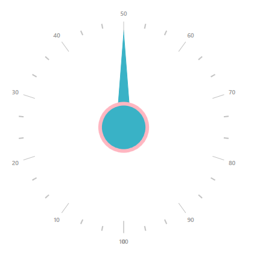

# How to customize a needle pointer in WPF radial gauge (SfCircularGauge)

This article explains to customize a needle pointer knob in Syncfusion WPF SfCircularGauge control  as shown in below.

 

To construct the above UI, follow the following steps

**Step 1:**

Initialize the WPF Circular gauge as per in below 

[XAML]

```
       <syncfusion:SfCircularGauge >
       </syncfusion:SfCircularGauge>
       
```

**Step 2:**

You can customize the needle pointer knob size, fill, stroke and stroke thickness by using KnobRadiusFactor, KnobFill, KnobStroke, KnobStrokeThickness properties.

| KnobRadiusFactor  | Used to customize the knob radius. |
| KnobFill  | Used to fill the color for knob.  |
| KnobStroke  |Used to customize the knob stroke color.  |
| KnobStrokeThickness | 	Used to change the knob stroke thickness.|
	

 [XAML]
 
 ```
        <syncfusion:SfCircularGauge >
            <syncfusion:SfCircularGauge.Scales>
                <syncfusion:CircularScale  ShowRim="False"  LabelPosition="Outside" TickPosition="Outside" FontSize="10" FontWeight="SemiBold" RadiusFactor="0.7" Interval="10" ShowFirstLabel="False" MinorTicksPerInterval="2" TickLength="20"  StartAngle="90" SweepAngle="360" StartValue="0" EndValue="100"  >
                    <syncfusion:CircularScale.Pointers>
                        <syncfusion:CircularPointer NeedlePointerType="Triangle"  NeedlePointerStroke="#39b2c6" KnobRadiusFactor="0.2" KnobStroke="LightPink" KnobStrokeThickness="6" KnobFill="#39b2c6" NeedlePointerStrokeThickness="25" NeedleLengthFactor="0.8" Value="50"/>
                    </syncfusion:CircularScale.Pointers>
                    <syncfusion:CircularScale.MajorTickSettings>
                        <syncfusion:MajorTickSetting Stroke="#c1c1c1" StrokeThickness="1"  Offset="0.5"  Length="20"/>
                    </syncfusion:CircularScale.MajorTickSettings>
                    <syncfusion:CircularScale.MinorTickSettings>
                        <syncfusion:MinorTickSetting Stroke="#c1c1c1" StrokeThickness="2" Offset="0.5" Length="8"/>
                    </syncfusion:CircularScale.MinorTickSettings>
                </syncfusion:CircularScale>
                </syncfusion:SfCircularGauge.Scales>
            </syncfusion:SfCircularGauge>
```

**See also**

[Needle pointer and customization in WPF SfCircularGauge](https://help.syncfusion.com/wpf/radial-gauge/pointers#needle-pointer)

[Range pointer and customization in WPF SfCircularGauge](https://help.syncfusion.com/wpf/radial-gauge/pointers#range-pointer)

[Symbol pointer and customization in WPF SfCircularGauge](https://help.syncfusion.com/wpf/radial-gauge/pointers#symbol-pointer)

[How to drag the circular pointer in WPF SfCircularGauge](https://help.syncfusion.com/wpf/radial-gauge/pointers#circular-pointer-dragging)

[Setting animation for pointer in WPF SfCircularGauge](https://help.syncfusion.com/wpf/radial-gauge/pointers#setting-animation-for-pointer)

[Setting multiple pointers in WPF SfCircularGauge](https://help.syncfusion.com/wpf/radial-gauge/pointers#setting-multiple-pointers)


